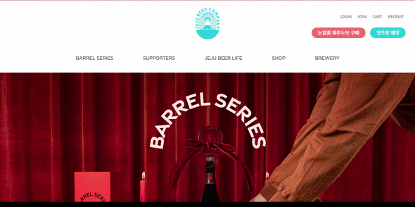
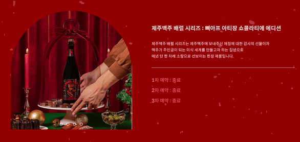
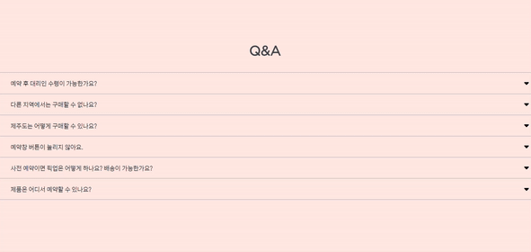

# 💡 **6주차 FE**

> [제주맥주 사이트 클론코딩](https://jejubeer.co.kr/2022barrelseries)
> 
> 
 

 

## **`구현하지 못한 부분`**

    1. 캐러셀 이미지 자동으로 넘어가기

    2. 페이지 하단 버튼 (공유버튼, 상단버튼)

 

 

## 제주맥주 사이트 클론코딩 구현 화면

 

### **전체 화면**

 

### **상세 화면**

 

### 네비게이션 바

 

### 캐러셀 1

 

### 캐러셀 2

 

### Q & A

 

 

## 알게된 점

    CSS BEM방법론을 사용해보면서 클래스명 작성법의 중요성을 알게 되었다.

    JS 제이쿼리문을 사용해보면서 기존 자바스크립트문과의 차이점에 대해서 알게 되었다.

## 아쉬운 점

    CSS에서 중복되는 부분을 재사용 하지 못했다.

    자바스크립트 공부를 더 해야겠다.