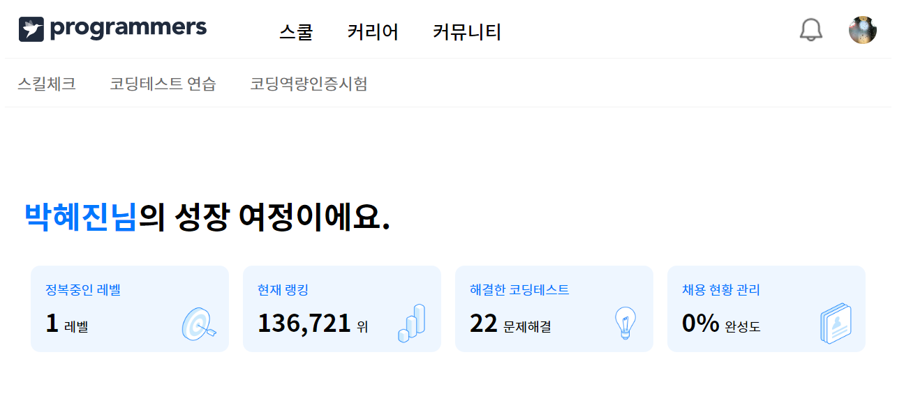
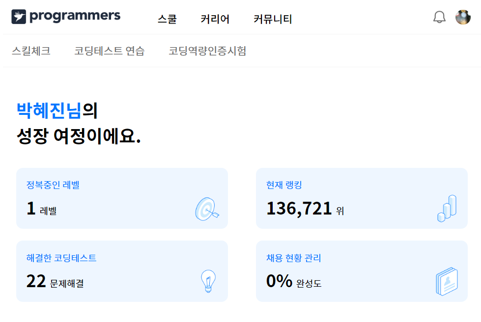
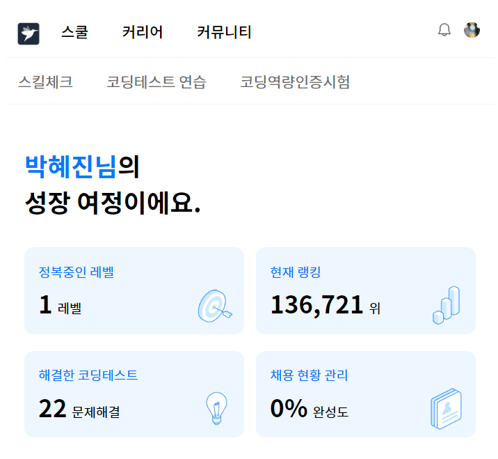

# 💡 **7주차 FE**

> [프로그래머스 클론코딩](https://programmers.co.kr/?utm_source=google&utm_medium=cpc&utm_campaign=brand_prgms_pc&gclid=CjwKCAiAwomeBhBWEiwAM43YIJiHepkMDSrg1XtsQjWCyu3ik3_xxAnskof8VS_8SRKQRf2WzA9jNRoCrKMQAvD_BwE)
> 
> 
 

 

## **`구현하지 못한 부분`**

    1. 광고 캐러셀 
     - 자동 슬라이드
     - 반응형
     - 크기가 줄어들 때 이미지가 사라지지 않기

    2. 수강 캐러셀
    - 마우스 호버했을 때 캐러셀 버튼 나타나기
    - 마우스 드래그로 캐러셀 이동

    3. 채용 프로그램

    4. 포지션

    5. 푸터

## **`고민한 부분`**
    1. 미디어쿼리 반응형 네브바

    max-width값을 이용하여 화면 크기 별로 네브바를 지정했으나, 화면 크기가 작은 기기에서 max-width값이 중복되는 영역이 발생해 네브바가 나타나지 않는 문제가 발생했다.
    따라서 각각 화면 별로 min-width값과 max-width값을 설정하여 사용하지 않는 부분은 display:none 처리를 해주었다.

    2. 광고 캐러셀 자동 슬라이드

    처음엔 엠블라캐러셀을 이용하여 자동슬라이드를 구현하려고 했으나, 각 캐러셀 아이템 너비를 width:100%로 설정한 탓인지 캐러셀 아이템이 이동하지 않고 첫번째 캐러셀 아이템 절반 부분정도만 무한 이동되었다. 너비 설정을 뷰포인터로도 해봤으나 실패했다.
    
    그 다음은 검색을 통해 바닐라 자바스크립트로 구현해보려고 했지만, 찾은 블로그에서는 모든 아이템들의 포지션을 앱솔루트로 겹쳐 쌓아올린 후 현재 보여지는 아이템을 제외한 다른 아이템들에 투명도를 주는 방식이었다. 이 방식을 사용하면 지금 구현한 형식을 다 뜯어 고쳐야했다. 마찬가지로 버튼이동도 다시 해야해서 포기했다.

    3. 광고 캐러셀 이미지 사라지지 않게 하기

    이미지의 포지션을 앱솔루트로 설정했을 때는 이미지가 블럭 위에 있기 때문에 화면 크기가 작아지더라도 이미지가 사라지지 않았다. 하지만 프로그래머스 홈페이지처럼 이미지가 왼쪽으로 이동하지는 않았다.
    캐러셀 효과로 인해 아이템 클래스에 포지션 릴레이티브가 들어가니 블럭 내부에 이미지가 고정되고 화면이 줄어들면 이미지가 사라지는 현상이 발생했다. 

 

 

## 프로그래머스 클론코딩 구현 화면

 

### **전체 화면**

 

### **반응형**

 

#### **데스크탑 사이즈**

 

#### **태블릿 사이즈**

 

#### **모바일 사이즈**

 

 

## 알게된 점
    - 반응형 폰트 크기

    항상 폰트를 px로 고정해서 사용했는데 뷰포인터(vw)를 사용하니까 화면이 작아지면 폰트 크기도 자동으로 작아졌다.
    다만, 1vw = 약 14px로 원하는 폰트크기를 사용하려면 소수점을 이용해서 폰트크기를 설정해야하는 번거로움이 있다.

    - 포지션 앱솔루트와 릴레이티브

    단순히 블럭 클래스로 사용했을 때는 겹치는 것과 겹치지않는 것으로 구분했었다. 자바스크립트로 캐러셀 효과를 구현해보면서 각 포지션의 차이가 명확하게 구별이 되었다. 앱솔루트는 각각의 블럭들이 위로 포개어 겹쳐지는 것으로 캐러셀로 구현할 때 나타나야 하는 블럭 외엔 모두 클래스에 투명도를 주었다. 반면 릴레이티브는 모두 나타나져있는 상태이지만 화면 크기를 초과해 보이지 않는 것이기에 너비를 이용하여 보여지는 화면을 설정한다.

## 아쉬운 점
    - 반응형 구현

    미디어쿼리로 각 크기를 설정해두고 해당 크기일 때 보여지는 방법으로 했더니 하나를 구현하더라도 크기 별로 구현해야해서 네 번씩 코드를 작성하게 됐다. 하면서도 이 방식이 아닐 거라고 생각했지만 현재 실력으로 하나의 코드로 짜기는 불가능했다.

    - 그리드 / wrap 사용법 미숙

    프로그래머스 홈페이지는 여러 블럭들이 수평으로 나열된 형식이 많았다. 화면이 작아지면 수평으로 나열된 블럭이 아래로 떨어졌다. 이는 그리드 혹은 wrap으로 구현할 수 있을 거같은데 flex를 자주 사용하다보니 위의 두 방법으로 하려니 생각대로 안됐다. 화면 크기별로 한 행에 나타나는 블럭의 개수를 지정하는 방법을 아직 모르겠다.

    - 자동 슬라이드 캐러셀

    6주차 미션 때 자동 슬라이드를 구현하지 못해서 이번에는 구현하고 싶었지만 실패했다. 반응형까지 신경써서 구현하려고 하니 캐러셀 구현을 어떻게 해야할지 아예 감을 못잡아서 3일정도 캐러셀만 붙잡고 있었더니 아무것도 하지 못했다.ㅜㅜ

    - 이름 / 알림 모달창

    프로필아이콘과 알림아이콘을 누르면 모달창이 나오는 것까지 구현해보고 싶었으나 역부족이었다. 반응형으로 홈페이지를 구현하는 것이 생각보다 더 많은 시간이 들어서 신경조차 쓰지 못했다.